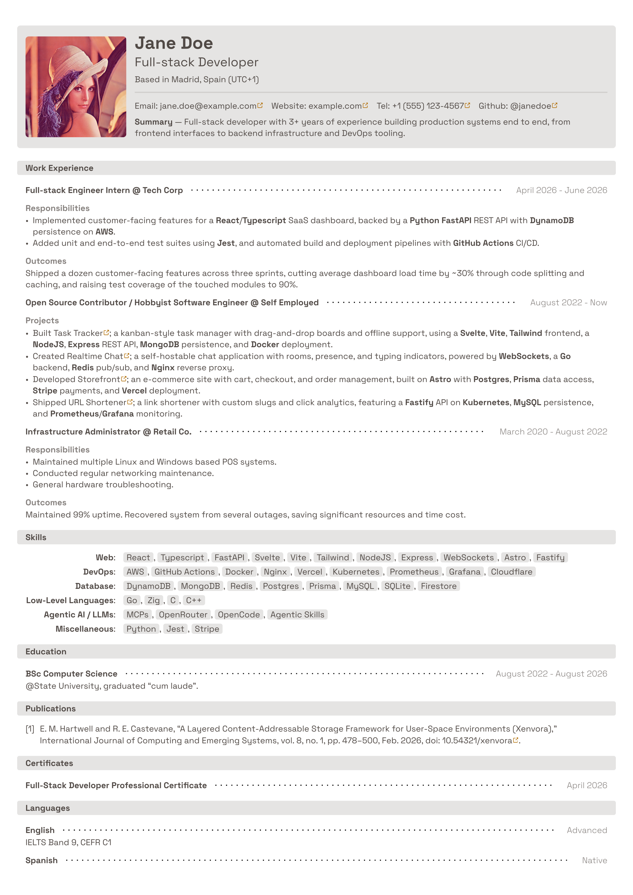

# atsthetic-cv

An ATS-friendly, aesthetic CV/resume template for [Typst](https://typst.app).

Resume content is written as plain, machine-parseable text (no multi-column
layout tricks), while still looking polished — rounded section bars, dotted rule
separators, pill-style skill chips, and optional profile photo.



## Features

- **ATS-friendly** — single-column flow, standard section headings, skills
  collected from plain text.
- **Aesthetic** — accent color, muted rounded blocks, external-link icons (via
  [octique](https://typst.app/universe/package/octique)).
- **Automatic skill registry** — tag skills inline as you write bullet points
  with `#s(...)`, then render them all in one place with `#skills()`. Duplicates
  are deduplicated and reported as warnings (via
  [uniwarn](https://typst.app/universe/package/uniwarn)).
- **Two variants** — with or without a profile image (`main.typ` /
  `with-image.typ`).
- **Themeable** — name, title, contact info, colors, and font size are all
  passed to a single `generate-blocks(...)` factory.

## Quick start

1. Start from the template

```sh
typst init @preview/atsthetic-cv cv && cd cv
```

2. Edit the following files in the `common` directory:
   - `blocks.typ` - customize the parameter of the `generate-blocks` function
   - `content.typ` - customize the content of your cv
   - `publications.yml` (optional) - if you want to include your publications
3. (Optional) If you want to use a profile picture in your cv, change the image
   in `with-image.typ`. Do your own research on whether or not this is a good
   idea.
4. Compile either `main.typ` or `with-image.typ`
